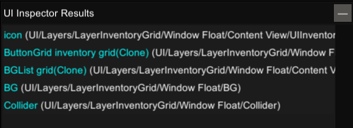

ここでは簡単な例として所持しているアイテムの個数の改変を通して、データの操作について触れてみます。

## 対象のアイテム（粗末な矢）

今回はコンテナ（木箱）に入った粗末な矢を例にします。  
画像から木箱の中に1本の矢があることを確認してください。

## インスペクターを起動する

`Unity Explorer`を起動します。初期設定では`F7`キーで起動します。  
起動すると画像のようなツールバーがウィンドウ上部に表示されます。

ツールバーから`Inspector`を選択します。  
ポップアップした`Inspector`ウィンドウの`Mouse Inspect`から`UI`を選択します。

## 調べたいもの（粗末な矢）を選択

画像のように選択モードに切り替わるので、木箱の中の粗末な矢を左クリックします。

  ※左クリックはアイテムを持つ動作と同じで矢を掴んでしまうので同じスロットに戻しておきましょう。


## アイテム（粗末な矢）のデータを辿る

画像のように`UI Inspector Results`に結果が表示されたら、`ButtonGrid`をクリックします。

次に`Inspector`ウィンドウが切り替わったら画像の`Component`セクションの`ButtonGrid`をクリックします。

その中に粗末な矢を参照している`Thing`がありますので、`Inspect`をクリックします。

## データ（個数）を改変する

ここまで来るとアイテムのデータを参照できるところまで来ています。  
リストの中から`Card.Num`を探します。

元が1本なので`1`と表示されています。ここでは例に`10`に書き換えてみます。  
書き換えた後に`Apply`をクリックするとデータが反映されます。

木箱の中の粗末な矢を確認すると10本に変わっています。

## まとめ

インスペクターで`ButtonGrid`を辿るなどの判断は経験則になってきますが、  
このようにして特定のアイテムのデータを探し当て、データを改変することができました。

アイテムやキャラクターにはどのようなデータ（値）があるのか、  
それは単体で改変が可能なものなのか、それとも演算や計算によって参照されるデータなのか、  
など、インスペクターだけでも様々な情報を得ることができます。

ぜひともご活用ください。
