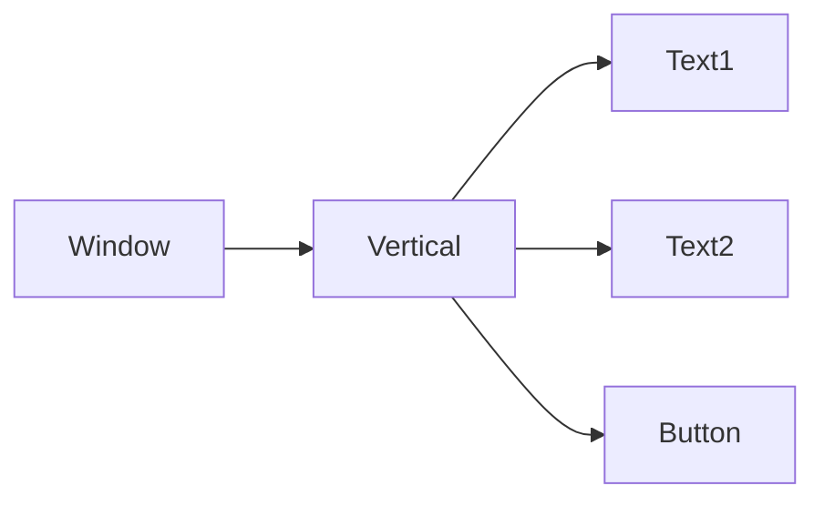

とてもシンプルな例とともにUI要素の配置について説明します。
UIの構造はツリー状のような構造で表現されます。

次の例では縦にテキストの「表示するテキスト１」「表示するテキスト２」と、ボタンの「ボタンのテキスト」が並ぶ構成です。

```C#
var window = this.Window(640, 480, "カスタムウィンドウ");
var layout = window.Vertical();
layout.Text("表示するテキスト１");
layout.Text("表示するテキスト２");
layout.Button("ボタンのテキスト", () => { Debug.Log("Pressed!"); });
```

構造を図で示すと次のようになります。



順序は宣言した順になるので、ボタンなどのインタラクティブな要素で、ほかの要素を参照する処理が必要な場合は注意が必要です。  
次の例のようにあらかじめ変数`text`を宣言して対応します。

```C#
var window = this.Window(640, 480, "カスタムウィンドウ");
var layout = window.Vertical();
layout.Text("表示するテキスト１");
UIHost<UIText> = text;
layout.Button("ボタンのテキスト", () => { /* 変数[text]をゴニョゴニョする */ });
text = layout.Text("表示するテキスト２");
```

例に挙げた`Vertical`や`Text`意外にもたくさんのUI要素が用意されています。

これらは[リファレンス]({})で詳細を確認できます。
